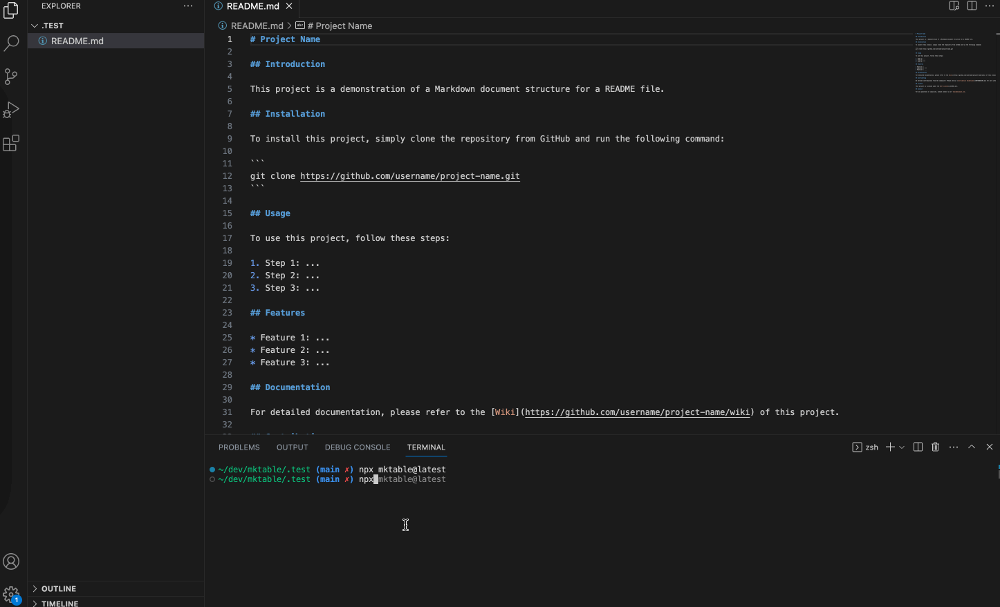

# MkTable

Dead simple CLI command to generate a table of contents from a markdown file



## Table of Contents

* [Example](#example)
  * [Write to your README.md file](#write-to-your-readme.md-file)
* [Author](#author)
* [License](#license)
* [FU](#fu)

## Example

```bash
$ npx mktable README.md
```

or install it globally

```bash
$ npm install -g mktable
```

### Write to your README.md file

```markdown
- [MkTable](#mktable)
  - [Example](#example)
  - [Installation](#installation)
  - [Usage](#usage)
  - [Options](#options)
  - [License](#license)
```

## Author

* [Wes Braga](https://github.com/wesbragagt)

## License

MIT
